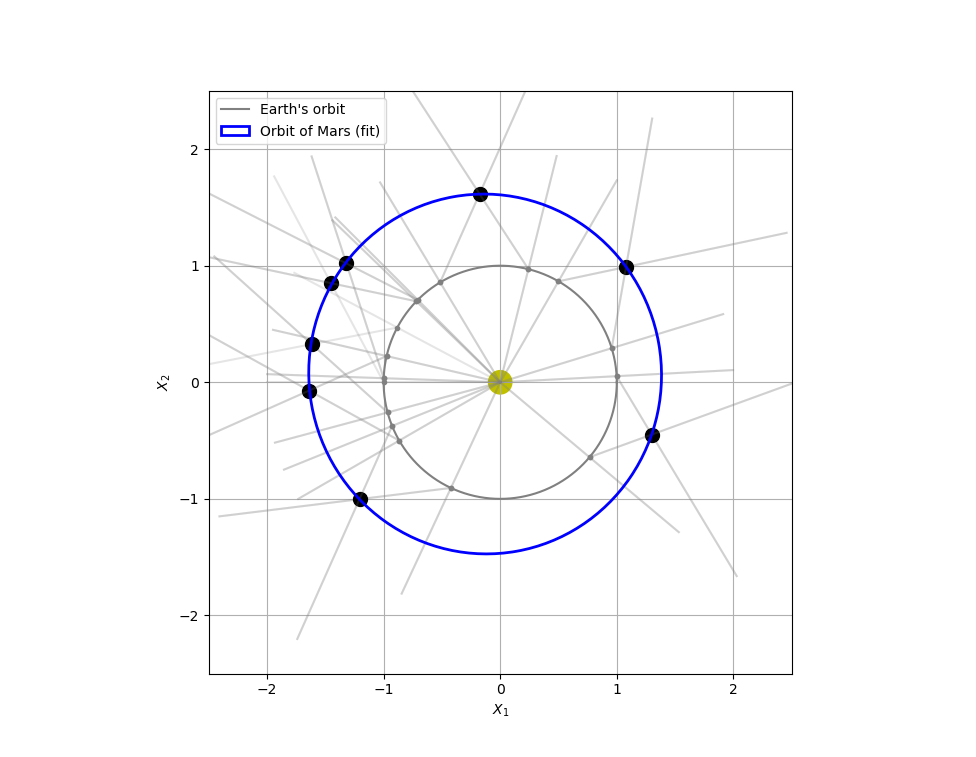

# Keplers-law-orbit-experiment-python
Kepler's law of orbits verification program written in Python

# Introduction

This is based on the lab experiment found [here](https://faculty.uca.edu/njaustin/PHYS1401/Laboratory/kepler.html#:~:text=Kepler%20was%20able%20to%20determine,its%20orbit%20every%20687%20days.).

# Libraries Used

* Matplotlib for plotting
* Pandas for reading data
* Numpy for calculation
* LsqEllipse for fitting ellipse

# Screenshots

